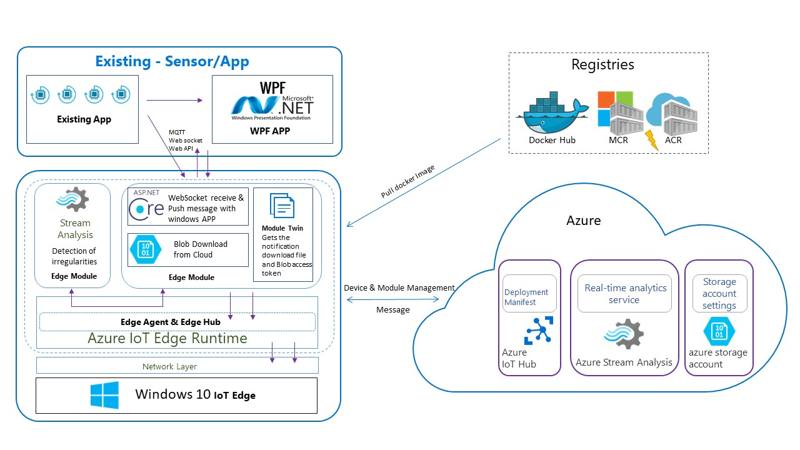
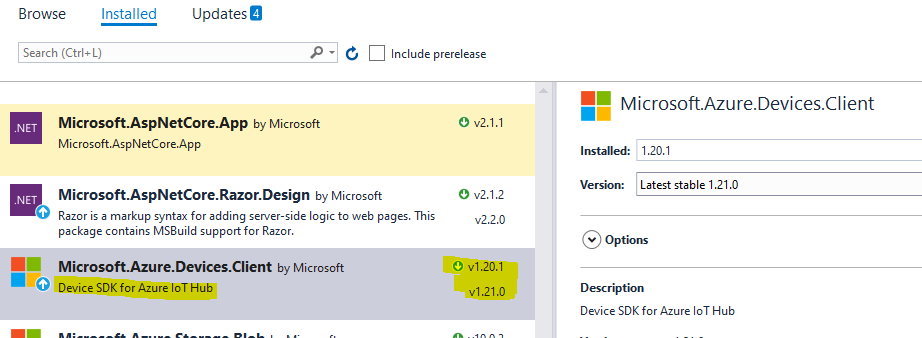
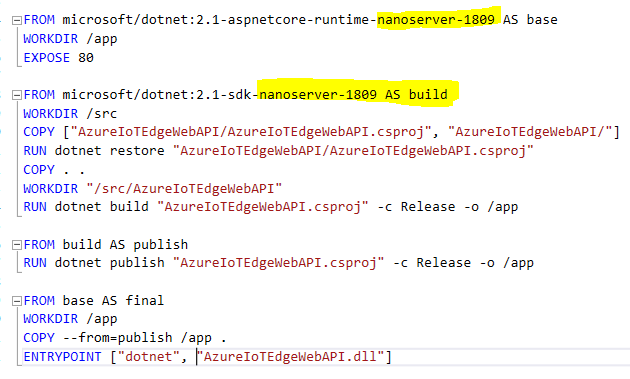
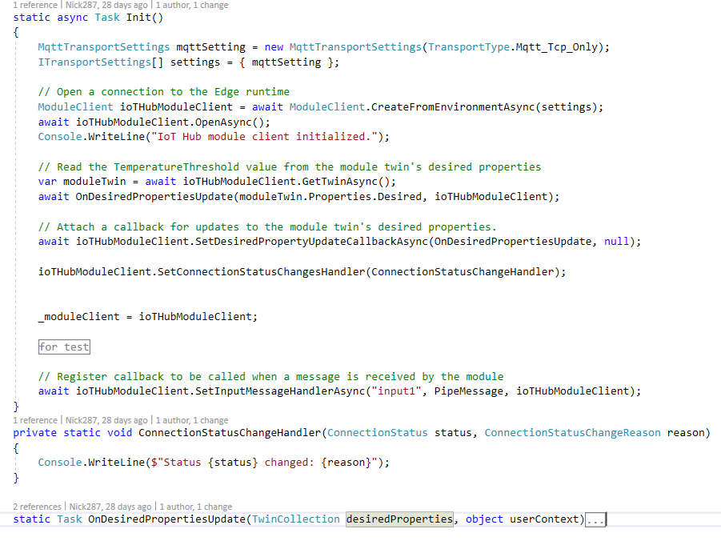
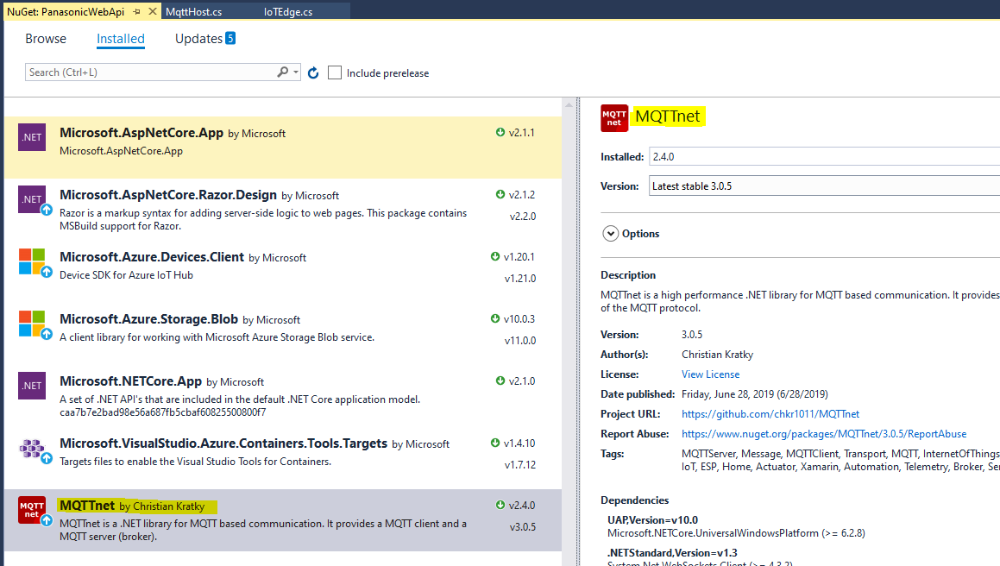

# Azure IoTEdge Communicate with Device

This open source project is an evolution of a real project. I have encountered many issues when working this project, and I have solved them one by one, so I would like share them here, hoping to help you.

This project related to following features
1. How to integration IoT edge device SDK with an Asp.NET core application
2. How to use device module Twin synchronous Data
3. How to use Blob API in iotedge
4. How to use Web Socket / REST API or Mqtt host service communicate with different kind of devices



### 1: How to integration IoT edge device SDK with an existing .NET core application

First of all, my project does not use the standard IoT Edge project template (of course, this is not recommended). Since I want to use the ASP.NET core project REST API, I directly use the .Net core project template.
So if you have a project that wants to port from a Docker image to IoT edge project, you can refer to my practice.

1. Add NuGet dependencise for IoT edge SDK

2. It is important to ensure that the Dockerfile image server version is the same as your operating system version In case if you are using a Windows container

3. Create a new class to handle IoT Edge SDK in my project that named IoT edge and then copy the main iot edge code to here or you can just use my [CLass](https://github.com/Nick287/AzureIoTEdgeWebAPI/blob/master/AzureIoTEdgeWebAPI/IoTEdge.cs)


I have used a *`static`* method to start the Edge SDK

```C#
try
{
    Task.Run(() =>
    {
        Console.WriteLine("go IoTEdgeGo");
        IoTEdge.IoTEdgeGo();
        Console.WriteLine("");
    });
}
catch (Exception ex)
{
    Console.WriteLine(ex.Message);
}
```

### **2 :** use device module Twin synchronous Data
The device side this is really simple

```C#
// Attach a callback for updates to the module twin's desired properties.
await ioTHubModuleClient.SetDesiredPropertyUpdateCallbackAsync(OnDesiredPropertiesUpdate, null);

 static async Task OnDesiredPropertiesUpdate(TwinCollection desiredProperties, object userContext)
{
    try
    {
        Console.WriteLine("Desired property change:");
        Console.WriteLine(JsonConvert.SerializeObject(desiredProperties));
    }
    catch (Exception ex)
    {
        Console.WriteLine();
        Console.WriteLine("Error when receiving desired property: {0}", ex.Message);
    }
}
```
The IoT Hub / Server Side 

My code show you how to get how many devices in IoT hub and query the edgemodule number for each Edge device, and how to get moduletwin in each edgemodule and modify submit it

```C#
public async Task EnumerateTwinsAsync()
{
    Console.WriteLine("Querying devices:");

    #region only for demo iot hub

    var query = _registryManager.CreateQuery("select * from devices");

    while (query.HasMoreResults)
    {
        IEnumerable<Twin> twins = await query.GetNextAsTwinAsync().ConfigureAwait(false);

        foreach (Twin twin in twins)
        {
            Console.WriteLine(
                " DeviceID: "+ twin.DeviceId + "\r\n" +
                " Is Edge device: " + twin.Capabilities.IotEdge +"\r\n" +
                " Status:" + twin.Status +"\r\n " + "\r\n" );

            var twin1 = await _registryManager.GetTwinAsync(twin.DeviceId);
        }
    }

    var device = await _registryManager.GetDeviceAsync("WinVM001");

    var edgemodules = await _registryManager.GetModulesOnDeviceAsync("WinVM001");

    var edgemodule = await _registryManager.GetModuleAsync("WinVM001", "moduleName");

    var moduletwin = await _registryManager.GetTwinAsync("WinVM002", "moduleName");

    #endregion
            
    var desiredproperties =
    @"{
        properties: {
            desired: {
                ""CloudStorageAccount"":""token"",
                ""ContainerName"" : ""test"",
                ""PathAndFileName"":""2617789e-d3db-3c23-bbad-4848cd8d9898.json""
            }
        }
    }";

    await _registryManager.UpdateTwinAsync(moduletwin.DeviceId, moduletwin.ModuleId, desiredproperties, moduletwin.ETag);
}
```

### 3 : How to use Blob API in iotedge

I use blobs because there are user scenarios where the client device needs to send multiple commands to the device such as configuration files that include download images, data filtering thresholds, and equipment configuration information etc. 

in my case I have used device Twin to sync / download the configuration file as a JSON.

1. Add NuGet dependencise for IoT edge SDK 

2. Use Blob SDK to download the file form the cloud and I have create a [CloudStorageHelper Class](https://github.com/Nick287/AzureIoTEdgeWebAPI/blob/master/AzureIoTEdgeWebAPI/CloudStorageHelper.cs) that can help you to do this more easier.  

```C#
static async Task OnDesiredPropertiesUpdate(TwinCollection desiredProperties, object userContext)
{
    try
    {
        Console.WriteLine("Desired property change:");
        Console.WriteLine(JsonConvert.SerializeObject(desiredProperties));

        if (desiredProperties["CloudStorageAccount"] != null)
            CloudStorageAccount = desiredProperties["CloudStorageAccount"];

        if (desiredProperties["ContainerName"] != null)
            ContainerName = desiredProperties["ContainerName"];

        if (desiredProperties["PathAndFileName"] != null)
            PathAndFileName = desiredProperties["PathAndFileName"];

        MemoryStream memoryStream = new CloudStorageHelper(CloudStorageAccount).DownloadFile(ContainerName, PathAndFileName);

        string text = System.Text.Encoding.UTF8.GetString(memoryStream.ToArray());

        Console.WriteLine("Download file read the file text is: " + text);

    }
    catch (AggregateException ex)
    {
        foreach (Exception exception in ex.InnerExceptions)
        {
            Console.WriteLine();
            Console.WriteLine("Error when receiving desired property: {0}", exception);
        }
    }
    catch (Exception ex)
    {
        Console.WriteLine();
        Console.WriteLine("Error when receiving desired property: {0}", ex.Message);
    }
    return Task.CompletedTask;
}
```

### 4:  How to use Web Socket / REST API or Mqtt host service communicate with different kind of devices

MQTT is a common protocol in the IoT world, so there are a lot of three-party libraries available without self-implementation, so I use [MQTTnet](https://www.nuget.org/packages/MQTTnet/) library here, and this library has a lot of reference code from internet. MQTT is subscription logic, so I created a server on edge you can reference my code [here](https://github.com/Nick287/AzureIoTEdgeWebAPI/blob/master/AzureIoTEdgeWebAPI/Hosting/MqttHost.cs)



and then you need create and client device to connect this server code like this

```C#
var mqttClient = new MqttClientFactory().CreateMqttClient();

var options = new MqttClientTcpOptions
{
    Server = "127.0.0.1",
    ClientId = "c001",
    UserName = "u001",
    Password = "p001",
    CleanSession = true
};

await mqttClient.ConnectAsync(options);

mqttClient.SubscribeAsync(new List<TopicFilter> {
    new TopicFilter("Home/LivingRoom/AirConditioner/#", MqttQualityOfServiceLevel.AtMostOnce)
});

var appMsg = new MqttApplicationMessage("Home/LivingRoom/AirConditioner/on-off", Encoding.UTF8.GetBytes("MessageContent"), MqttQualityOfServiceLevel.AtMostOnce, false);

mqttClient.PublishAsync(appMsg);


MqttNetTrace.TraceMessagePublished += MqttNetTrace_TraceMessagePublished;

private static void MqttNetTrace_TraceMessagePublished(object sender, MqttNetTraceMessagePublishedEventArgs e)
{
    Console.WriteLine($">> thread ID：{e.ThreadId} source：{e.Source} The trace level：{e.Level} Message: {e.Message}");

    if (e.Exception != null)
    {
        Console.WriteLine(e.Exception);
    }
}
```

It's pretty simple if you want to use WEB REST API or web socket, It's not much different than developing applications on a server and eventually packaging them into container image. The only thing to note is that the host native address should be "0.0.0.0" instead of "127.0.0.1" because it is in the container.

Socket code please reference [Socket Class](https://docs.microsoft.com/en-us/dotnet/api/system.net.sockets.socket?view=netcore-2.0) or  reference my code [here](https://github.com/Nick287/AzureIoTEdgeWebAPI/blob/master/AzureIoTEdgeWebAPI/Hosting/SocketHostCore.cs)

for Web API you can follow this [tutorial](https://docs.microsoft.com/en-us/aspnet/core/tutorials/first-web-api?view=aspnetcore-2.2&tabs=visual-studio) to create your app and then package it into a docker image. [Dockerize an ASP.NET Core application](https://docs.docker.com/engine/examples/dotnetcore/)

